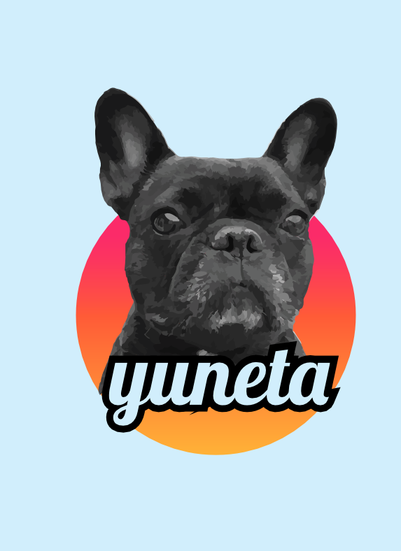

Yuneta
======

-------------------------------------------------

Nuestro producto
================

Cuál es el producto, la unidad básica para un desarrollador de aplicaciones? ::

    - ejecutable
    - aplicación
    - daemon
    - ...

Lo que hay debajo de una aplicación ::

    - sistema operativo
    - drivers
    - redes

lo tenemos que conocer, pero no es nuestro mundo. Sómos usuarios de esos mundos.

-------------------------------------------------

Lenguajes, qué lenguaje?
========================

Veo surgir nuevos lenguajes de programación cada día.

¿No es mejor usar un **método de programación** que sirva para **todos** los lenguajes?

-------------------------------------------------

Normaliza el ejecutable
=======================

Normaliza tu aplicación::

* Mismos parámetros para todos los ejectuables.
* Configuración en su exterior y en su interior en formato JSON.

.. sourcecode:: bash

    Usage: yunetaAgentt [OPTION...] json-config...
    yunetaAgentt -- Yuneta Real Test Agent

    -S, --start                       start the program (as daemon)
    -K, --stop                        stop the program (as daemon)
    -f, --config-file=JSON-FILE       use settings from json config file
    -e, --extra-config-file=JSON-FILE use extra settings from json config file
    -p, --settings                    check and print the settings
    -P, --final-settings              check and print the final settings
    -o, --log-oids                    log the mib oid's
    -v, --version                     print program version
    -r, --role                        print role name
    -?, --help                        print this help

    Report bugs to <niyamaka at yuneta.io>

-------------------------------------------------

Normaliza el ejecutable
=======================

Si tu aplicación tiene un **rol**,

entonces ya no es una aplicación,

no es alguien neutro,

**es** ese **rol**.

A eso le llamo **yuno**.

-------------------------------------------------

Virtualiza el desarrollo
========================

El elemento básico es el yuno::

    * un daemon normalizado
    * comunicándose en json.

Un Yuno es::

    * un ente virtual
    * se comporta como un robot
    * vive en algún hospedaje
    * es único o repetido
    * ofrece servicios.

-------------------------------------------------

Virtualiza el desarrollo
========================

Qué servicios ofrece un yuno?::

    * el que tú quieras
    * ese es tu trabajo primordial
    * diseñar lo que ofrece un yuno.
    * dótarle de un rol.

El servicio que ofrece un yuno es su rol::

    * Asígnale un rol
    * que defina bien lo que hace
    * que sea único en tu sistema

-------------------------------------------------

Virtualiza el desarrollo
========================

Ya tienes ya definidos::

    * tu ejercito de yunos
    * el rol de cada uno
    * si tienen identidad o son clonables.

Ahora te falta diseñar el esquema de conexiones entre los yunos.

Quieres redundancia?::

    * haz multiples conexiones entre ellos.

-------------------------------------------------

Virtualiza el desarrollo
========================

El diseño con Yuneta empieza::

    * creando los roles
    * definiendo sus mensajes de entrada y salida

y termina::

    * interconectándolos en un reino de yunos.

-------------------------------------------------

Yuno
====

Yuno? y eso qué es...::

    * un hijo de yuneta
    * un daemon
    * un servicio
    * un micro-servicio
    * ....

que tiene un **rol**.

-------------------------------------------------

Yuno
====

y qué rol le doy a mi yuno?

usa tu imaginación,

ahí es donde está tu trabajo como desarrollador,

diseña tu sistema con yunos!

-------------------------------------------------

Yuno
====

Un yuno solitario, standalone, que solo cabalgue en su host o container, los hay!
pero la tendencia es compartir, comunicarse.

Facilítame la vida, que los yunos se puedan relacionar, comunicar, compartir,
que esa facilidad esté incorporada en todos los yunos.

Cúal es el formato nativo de comunicación entre yuno? mensajes JSON.

-------------------------------------------------

Yuno
====

Completemos el yuno:

    * ponle un **nombre** si quieres personalizar su rol.

    * publica los mensajes que admite de entrada.
      Son los eventos externos que moverán la maquinaria interna.

    * publica los mensajes de salida que emite.
      Los clientes podrán subscribirse a los que necesiten.

-------------------------------------------------

Yuno
====

Qué necesito conocer para poder enviar o recibir un mensaje de un yuno?

    *  **rol** del yuno
    * **nombre** del yuno

-------------------------------------------------

Yuno
====

No podría ir en el mensaje, un campo más,

que me permita procesar más fácilmente los mensajes?

Añadimos al mensaje un campo, el nombre de un **objeto**. Úsalo como quieras.

    *  **rol** del yuno
    * **nombre** del yuno
    * **objeto**

-------------------------------------------------

Reino de Yunos
==============

Diseña tu sistema, organiza y diseña la interconexión de tus yunos

con la topología que quieras.

El territorio donde los yunos vecinos colaboran entre sí
(host, container, vm)

lo llamo reino (**realm**).

Ya no son **standalone** yunos.

-------------------------------------------------

Reino de Yunos
==============

Diseña tu red de yunos pensando que,

una vez instalado un yuno en el reino,

su rol está disponible para todos los demás.

-------------------------------------------------

Reino de Yunos
==============

Si quieres aumentar la seguridad en la entrega de mensajes ::

    * duplica roles
    * duplica conexiones!

Cuellos de botellas en los mensajes? ::

    * usa yunos sin nombre, anónimos
    * clónalos según tu necesidad.

-------------------------------------------------

Reino de Yunos
==============

Yuneta incorpora::

    * yuno Agente para crear y controlar reinos.
    * interfaz CLI para operar al Agente.

Yuneta incorpora::

    * una utilidad de plantilas
    * para crear todo el projecto básico de un yuno, en C.

-------------------------------------------------

Dentro del Yuno
===============

Organización interna de los yunos ::

    * estructura de objetos organizados en arbol invertido.

Lo que es arriba es abajo, lo que es fuera es dentro::

    * la comunicación entre objetos es con mensajes JSON.

Los objetos de un yuno se llaman **GObj**.

-------------------------------------------------

GObj
====

Los **GObj** internamente tienen::

    * atributos
    * máquina de estados finitos (FSM)

La FSM es la encargada de procesar los mensajes entrada y salida.

-------------------------------------------------

Fin
===

-------------------------------------------------

Yuneta
======

Los yunos #raiz pueden tener

    yunos #hijo,

administrados

    por ellos mismos

y no por el yuno #agente.

-------------------------------------------------

Yuneta
======

Ya puestos, y si no te basta con tener un

    #reino de yunos,

puedes crear muchos reinos de yunos y unirlos en un

    #imperio de yunos.

-------------------------------------------------

Yuneta
======

Y si tampoco tienes bastante con un

    #imperio de reinos de yunos,

puedes crear una

    #galaxia de imperios de reinos de yunos.

-------------------------------------------------

Yuneta
======

y como lo que es arriba es abajo,

dentro de un yuno, hay una estructura jerárquica de

    #objetos.

Objetos con

    #nombre

y

    #anónimos.

-------------------------------------------------

Yuneta
======

Los mensajes entre yunos siempre son entre objetos con

    #nombre

y con un modelo de envio

    #directo

o por

    #subscripción.

-------------------------------------------------

Librerias estáticas
===================

Entiendo el uso de librerías dinámicas cuando había escasez de memoria.

Pero ahora, sobrando memoria, usa librerías estáticas.

Con las librerías estáticas:

adiós a los problemas de incompatibilidad con las versiones de las librerias usadas.

-------------------------------------------------

GObjs
=====

Para saber si una variable tiene que ir en::

    * la tabla de atributos
    * o en datos privados,

usa el siguiente criterio:

la variable puede ser **modificada desde fuera** ?::

    * entonces a la tabla de atributos,
    * evitarás tener que modificar el código.

-------------------------------------------------

Yuneta
======

Con yuneta, el desarrollo y la operación van de la mano

    #devop

