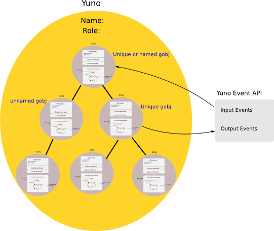
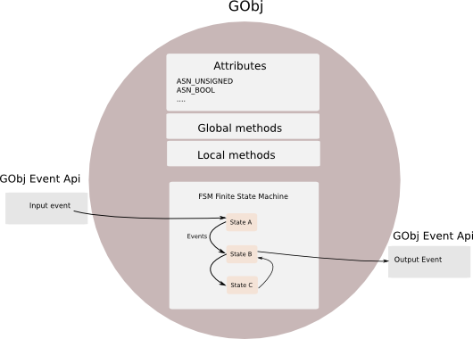
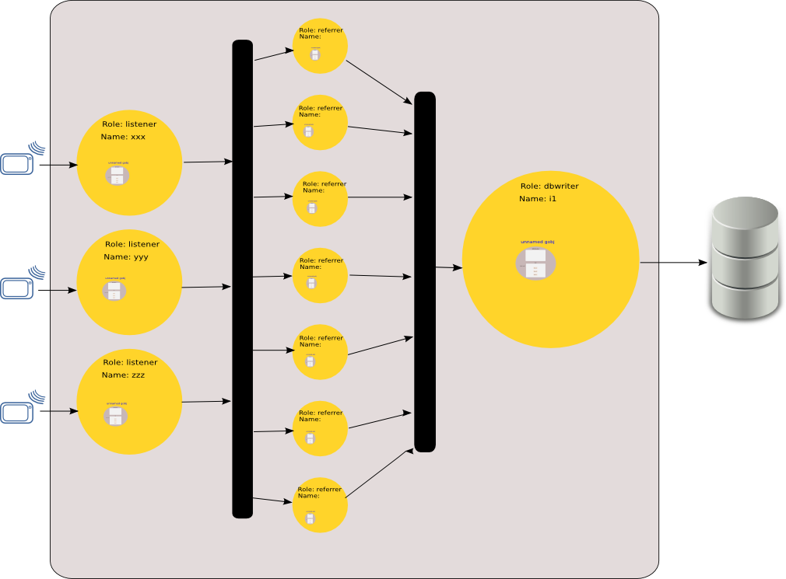

Yuneta
======

C Framework
===========

.. image:: yuneta.png
   :scale: 50 %

-------------------------------------------------

El mundo del desarrollador
==========================

Cuál es nuestro **producto final**,
la unidad básica para un **desarrollador** de aplicaciones?

    - ejecutable
        - aplicación
        - daemon

y

    - configuración
        - ini
        - xml
        - json
        - ...

-------------------------------------------------

Resto del mundo
===============

El resto del mundo:

    - sistemas operativos, sistema de ficheros, drivers
    - hardware, routers, firewalls
    - máquinas virtuales, bases de datos
    - ...

lo tenemos que conocer, pero

    **no es nuestro mundo**.

Sómos **usuarios** de esos mundos.

-------------------------------------------------

Normalizar nuestro mundo
========================

Nuestro elemento mas básico?

    * el ejecutable (@exe)
    * su configuración (@config)

**Normalicemos**

    **@exe**

y

    **@config**

-------------------------------------------------

Normalizar @exe
===============

Cómo normalizamos **@exe**?

    * Idénticos parámetros de ejecución en línea de comando.

Cómo normalizamos **@config**?

    * Usando el formato más sencillo para su representación: JSON

-------------------------------------------------

Normalizar @exe
===============

Normalicemos @exe al estilo Unix:

.. sourcecode:: bash

    $> yunetaAgentt --help

    Usage: yunetaAgentt [OPTION...] json-config...
    yunetaAgentt -- Yuneta Real Test Agent

    -S, --start                       start the program (as daemon)
    -K, --stop                        stop the program (as daemon)
    -f, --config-file=JSON-FILE       use settings from json config file
    -e, --extra-config-file=JSON-FILE use extra settings from json config file
    -p, --settings                    check and print the settings
    -P, --final-settings              check and print the final settings
    -o, --log-oids                    log the mib oids
    -v, --version                     print program version
    -r, --role                        print role name
    -?, --help                        print this help

    Report bugs to <niyamaka at yuneta.io>

-------------------------------------------------

Normalizar @exe
===============

Avancemos más en la normalización:

Dotemos de **personalidad** a

    **@exe**

**Cómo?**

Asignándole:

    * un **#rol**

y opcionalmente

    * un **#nombre**

-------------------------------------------------

Normalizar @exe
===============

**@exe** tiene que informar claramente cuál es su  **#rol** y **#nombre**

.. sourcecode:: bash

    $> yunetaAgentt --role

    yuno 'yunetaAgentt' '' '1.0.0' '1.0.0' '[6997]' '[2162]'

    $>

-------------------------------------------------

Normalizar @exe
===============

**@exe** tiene que ser capaz de correr como

    daemon

y estar protegido de

    muerte súbita.

.. sourcecode:: bash

    $> yunetaAgentt --start

    $> ps -e |grep yuneta

    1309 ?        00:00:00 yunetaAgentt
    1310 ?        00:00:07 yunetaAgentt

    $> yunetaAgentt --stop

-------------------------------------------------

Normalizar @config
==================

Normalicemos **@config**.

Configuración flexible, que podrá residir en:

    * código
    * fichero
    * en línea de comando

Tendrá:

    * zonas fijas
    * zonas variables.

-------------------------------------------------

Normalizar @config
==================

Normalicemos **@config**.

La configuración final será la suma de

    * @config-interna
    * @config-ficheros
    * @config-línea-comando.

.. sourcecode:: bash

    $> watchfs \
        -f 'default.json' \
        -e '3071.json' \
        '{"yuno": {"__routerPort__": 3333}}'

-------------------------------------------------

Normalizar @config
==================

Normalicemos **@config**.

Las zonas fijas

    no pueden ser modificadas, ni desde fichero, ni desde línea de comando.

Las zonas variables

    sí pueden ser modificadas.

.. sourcecode:: bash

    PRIVATE char fixed_config[]=
    {
        "yuno": {
            "__yuno_role__": "mq"
        }
    };

    PRIVATE char variable_config[]=
    {
        "yuno": {
            "__yuno_name__": ""
        }
    };

-------------------------------------------------

Yunos
=====

A este **@exe** y **@config**,

dotado de

    **#rol**

y opcionalmente con

    **#nombre**,

lo llamaremos

    **#yuno**,

el hijo de **#yuneta**.

-------------------------------------------------

Yunos
=====

Normalicemos los **#yunos**.

Un yuno puede correr de manera

    solitaria (standalone),

pero la tendencia es compartir, comunicarse.

Yuneta facilita la vida del desarrollador y del operador,
y permite que los yunos se puedan

    relacionar, comunicar, compartir

-------------------------------------------------

Yunos
=====

Normalicemos los **#yunos**.

Dotemos a los

    **#yunos**

de la capacidad de

    **intercomunicarse**

entre ellos.

De una manera sencilla, usando mensajes

    **#json**

y simplemente conociendo del destinatario su

    **#rol**

    **#nombre**

-------------------------------------------------

Yunos
=====

Normalicemos los **#yunos**.

Todo **#yuno** que quiera intercomunicarse necesita activar
un

    **routerPort**

.. sourcecode:: bash

    $> yunetaAgentt --role

    yuno 'yunetaAgentt' '' '1.0.0' '1.0.0' '[6997]' '[2162]'

    $>

El **routerPort** del yuno agente del reino en preproducción es el 6997

-------------------------------------------------

Yunos
=====

Ejemplo de mensaje entre **#yunos**

.. sourcecode:: bash

    ~ {
        "iev_dst_yuno": "Ph2e",
        "iev_dst_role": "h2email",
        "iev_dst_srv": "persist",
        "iev_event": "EV_REMOVE_IEVENT",
        "iev_src_yuno": "Pems",
        "iev_src_role": "emailsender",
        "iev_src_srv": "router",
        "iev_kw": {
            "store": "*",
            "room": "*",
            "shelf": "*",
            "owner": 0,
            "reference": "5-055A4B97D-0A6EE8E1-0000000040043B54-0000C5FD"
        }
    }

-------------------------------------------------

Reinos
======

Los **#yunos** interconectados se organizan en

    **#reinos** de yunos

Un **#reino** de yunos se aloja en un

    servidor físico,

    servidor virtual,

    o container.

Sólo en sistemas

    linux

o

    compatibles POSIX.

-------------------------------------------------

Reinos
======

Para gestionar el **#reino** se crea la figura del yuno

    **agente**

El yuno **agente** gestiona el

    despliegue
    configuración
    operación

de los yunos **ciudadanos** del reino.

-------------------------------------------------

Reinos
======

El **agente** del reino.

Consta de dos yunos y dos ambientes:

**preproducción**:

    yunetaAgentt (daemon)

    yuneta-t (CLI)

**producción**:

    yunetaAgent (daemon)

    yuneta (CLI)

-------------------------------------------------

Reinos
======

.. sourcecode:: bash

    $> yuneta-t
    Wellcome to Yuneta CLI.
    Type help for assistance.

    yuneta-t> ?
    quit                Exit of yuneta
    help                Display help

    install    yuno     Install new yuno
    update     yuno     Update a yuno
    remove     yuno     Remove a yuno
    activate   yuno     Mark a version as 'official' to start/stop
    deactivate yuno     Unmark the current 'official' version to start/stop
    list       yuno     List yunos

    install    conf     Install new config of yuno
    update     conf     Update config of yuno
    remove     conf     Remove config of yuno
    activate   conf     Mark config as 'official' to start/stop
    deactivate conf     Unmark the current 'official' config to start/stop
    list       conf     List configurations

    clean      yuno     Clean binaries and configurations

    run        yuno     Run the activated version of a yuno
    kill       yuno     Kill the running yuno

    play       yuno     Play the running yuno
    pause      yuno     Pause the running yuno

    top                 List state of activated yunos

    stats      yuno     Get statistics from matched yunos
    command    yuno     Execute command in matched yunos

    yuneta-t>

-------------------------------------------------

Reinos
======

En el **#reino** de **nivel 1**, el implementado hasta ahora,

el agente

    despliega y controla #yunos

    despliega y controla @configuraciones,

pero **no controla routerPorts**.

El diseñador de **#reinos** tiene que definir en cada **yuno** su

    **routerPort**

y la interconexión entre ellos explicitamente con

    **rutas estáticas**.

-------------------------------------------------

Reino de nivel 1
================

Existen

    **yunos solitarios** (standalone)

y yunos que prefieren acogerse a la dictadura benévola de un

    **reino**.

En el reino de primer nivel,
el agente sólo es la puerta de entrada y salida,
y el registro central de los yunos moradores.

En el reino de primer nivel,
los yunos organizan ellos mismos su identidad (**routerPort**) en el reino.

Los yunos se apuntan en lista pública de ids,
y van cogiendo números consecutivos.

El yuno informa al agente de su id.

-------------------------------------------------

Reino de nivel 2
================

**FUTURO**

El reino de **nivel 2** tendrá yunos especializados además del **agente**:
observador, visualizador, tasker, yunos semi-humanos, ...

El reino de **nivel 2** ya no será un recinto autogestionado por el
diseñador de reinos.

El **agente** asignará los **id's** y existirá un servicio DNS
para localizar a un yuno por su rol y nombre.

Se podrán unir **#reinos** para formar  **#imperios** de yunos.

Y se podrán unir **#imperios** de yunos para formar **#galaxias** de imperios de reinos de yunos.

Será la base para implementar `BPM <https://en.wikipedia.org/wiki/Business_process_management>`_

-------------------------------------------------

Reino de nivel 2
================

**FUTURO**

Agente de nivel 2 (FUTURE): dos tipos de reinos,

    reino de nombre único

y

    reino sin nombre o con nombre no-único.

Lo que es arriba es abajo.

Reino de nombre único, puede estar clonado por seguridad:

    activo/pasivo

    árbol jerárquico distribuido.

Reino sin nombre único

    puede ser clonado sin límite para multiplicar su fuerza.

El agente de nivel 2 controla el despliegue de yunos en los reinos bajo su control.

-------------------------------------------------

Intercambio de mensajes
=======================

Los **#yunos** entre sí intercambian mensajes mediante los modelos:

    request-response,

    subscribe-publish,

    o direct-send.

Estos mismos modelos se usan también en el interior de los **#yunos**.

Los **#yunos** internamente están organizados como un árbol invertido
y jerárquico de objetos llamados **GObjs**.

(Lo que es arriba es abajo, lo que es dentro es fuera)

-------------------------------------------------

Intercambio de mensajes
=======================

**direct-send** implica un

    envio

sin esperar respuesta o una respuesta inmediata.

-------------------------------------------------

Intercambio de mensajes
=======================

**request-response** implica un

    envio

y sí espera una

    respuesta

y por lo tanto el emisor normalmente

    cambia al estado de **esperar** esa respuesta.

-------------------------------------------------

Intercambio de mensajes
=======================

En **request-response** el json de respuesta debería incluir los campos

    **"result"**

y

    **"data"**

Para lectura fácil de humanos y yunos.

**"result"** es un integer con el retorno estandar de C

    0 ok

    <0 error

En "data" los datos json que se quieran.

-------------------------------------------------

Intercambio de mensajes
=======================

**subscribe-publish** ya se sabe.

    Suscríbete

a un evento, y cuando dicho evento ocurra

    se te informará.

Con filtros para que matchear los eventos a tu gusto

-------------------------------------------------

Yuneta
======

Define tu mundo con los **roles** y el **flujo de mensajes** de **Yuneta**.

Investiga y descubre el flujo de datos de tu negocio e impleméntalo con yunos.

Lo podrás visualizar y controlar.

Llegarás a conocer profundamente tu mundo.

Tendrás control total de tu actividad.

-------------------------------------------------

Yuneta
======

Cuando las

    "comunicaciones entre aplicaciones",

tienen más peso que las

    propias aplicaciones,

el

    **modelo tiene que cambiar**.

-------------------------------------------------

Yuneta
======

Los datos importantes?

Ahora es más importante el

    **intercambio** de esos datos,

la

    política de intercambios,

la

    filosofía de los intercambios,

el

    diseño de los intercambios.

**Cambio de modelo**.

-------------------------------------------------

Yuneta
======

Ya no existe eso de

    jefe, director, subdirector, encargado, operario...

ahora es

    agente de reino,

    observador,

    dibujante...

    y los yunos y sus mensajes.

**Cambio de modelo**.

-------------------------------------------------

Yuneta
======

Empresa, organización, o lo que seas:

    conoces los roles y el flujo de información en tu empresa?

Pues deberías.

Disecciona tu empresa o negocio y descubre

    los roles necesarios,

    quien los ostenta,

    y los servicios que se intercambian entre ellos.

-------------------------------------------------

Yuneta
======

Cuando hayas

    diseccionado tu negocio

y lo hayas

    representado con Yuneta,

tendrás

    control,

    conocimiento.

Podrás

    mejorarlo

y

    optimizarlo.

-------------------------------------------------

Yuneta
======

Lo que es arriba es abajo, y lo que es dentro es fuera.

    **Yunos**?

    **GObjs**?

es la misma cosa pero en diferente nivel.

Diferencia entre **GObjs** y **Yunos** a nivel funcional?

a los

    **GObjs** los tiene que conocer el **desarrollador**,

a los

    **Yunos** los tiene que conocer el **cliente**.

-------------------------------------------------

Yuno
====

-------------------------------------------------

GObj
====

-------------------------------------------------

GObjs
=====

Quieres saber algo más del **GObj**?

Internamente tiene una tabla de

    **atributos** estructurados

y un

    **autómata** o `FSM (Finite State Machine) <https://en.wikipedia.org/wiki/Finite-state_machine>`_

Los **atributos** están definidos con estandar `ASN1 <https://en.wikipedia.org/wiki/Abstract_Syntax_Notation_One>`_

y son accesibles por `SNMP <https://en.wikipedia.org/wiki/Simple_Network_Management_Protocol>`_

-------------------------------------------------

GObjs
=====

Y ahora quieres conocer un secreto?

La **@config** de un yuno es un **fiel reflejo** de los

    **atributos**

de todos sus

    **GObj** internos.

-------------------------------------------------

Eventos
=======

Otro secreto?

Un **autómata** se mueve por

    **eventos**

Los

    **mensajes** entre yunos

contienen el nombre del

    **evento**

y sus

    **propiedades**

-------------------------------------------------

Eventos
=======

Ejemplo de mensaje entre yunos.

.. sourcecode:: bash

    ~ {
        "iev_dst_yuno": "Ph2e",
        "iev_dst_role": "h2email",
        "iev_dst_srv": "persist",
        "iev_event": "EV_REMOVE_IEVENT",
        "iev_src_yuno": "Pems",
        "iev_src_role": "emailsender",
        "iev_src_srv": "router",
        "iev_kw": {
            "store": "*",
            "room": "*",
            "shelf": "*",
            "owner": 0,
            "reference": "5-055A4B97D-0A6EE8E1-0000000040043B54-0000C5FD"
        }
    }

-------------------------------------------------

Circulos
========

Cerrando un circulo:

Consulta

    las tablas de **atributos**

de los

    **GObj**

para conocer la

    **@config**

de un

    **yuno**

-------------------------------------------------

Circulos
========

Cerrando otro circulo:

Consulta el

    **autómata**

de los

    **GObj** públicos

para conocer el

    **interface** o **API**

de un

    **yuno**

-------------------------------------------------

C Framework
===========

**Yuneta** es un **framework** cercano a la

    **máquina**

y al

    **sistema operativo**

porque está escrito en **C**,

pero es también de

    **desarrollo rápido**

y

    **moderno**

Es

    **Json inside**

-------------------------------------------------

C Framework
===========

**Yuneta** es un **framework** para mentes

    sin memoria,

    olvidadizas,

    cada día más torpes,

como la del autor de Yuneta.

    Memoria

por

    lógica estructurada.

-------------------------------------------------

C Framework
===========

**Yuneta** es un **framework** de naturaleza **asíncrona**,
construido sobre las librerias de `gobj-ecosistema <https://bitbucket.org/gobj-ecosistema/>`_

`gobj-ecosistema <https://bitbucket.org/gobj-ecosistema/>`_ es un conjunto de cuatro librerias **estáticas**:

    * `GinsFSM <https://bitbucket.org/gobj-ecosistema/ginsfsm>`_ (autómatas sencillos)
    * `GHelpers <https://bitbucket.org/gobj-ecosistema/ghelpers>`_ (utilidades)
    * `external-libs <https://bitbucket.org/gobj-ecosistema/external-libs>`_:
        - `libuv <http://libuv.org/>`_ (event loop, plataforma de `Node.js <https://nodejs.org/>`_)
        - `jansson <http://www.digip.org/jansson/>`_ (json)

-------------------------------------------------

C Framework
===========

Los componentes de **Yuneta** son:

    * libreria `c-core <https://bitbucket.org/yuneta/c-core>`_.
    * yuno `yuneta Agent <https://bitbucket.org/yuneta/yuno_agent>`_ .
    * yuno `yuneta CLI <https://bitbucket.org/yuneta/yuno_cli>`_.

Todos ellos se compilan con `CMake <http://www.cmake.org/>`_.

Otro proyectos auxiliares son:

    * `Yunos Template <https://bitbucket.org/yuneta/yunotemplate>`_.
      Una utilidad en Python con plantillas de yunos.
    * `js-core <https://bitbucket.org/yuneta/js-core>`_.
      Versión Javascript de Yuneta para correr en navegadores.

-------------------------------------------------

Librerias estáticas
===================

Entiendo el uso de librerías dinámicas cuando había escasez de memoria.

Pero ahora, sobrando memoria, usa librerías estáticas.

Con las librerías estáticas:

adiós a los problemas de incompatibilidad con las versiones de las librerias usadas.

-------------------------------------------------

Ejemplo de reino
================

Reino de GPSS
-------------

