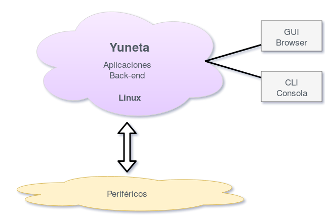
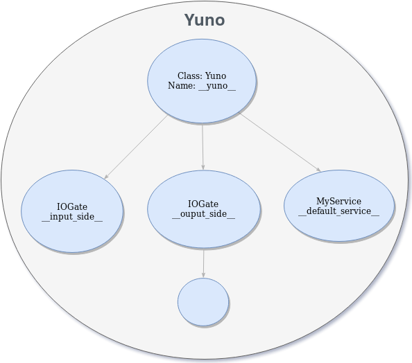
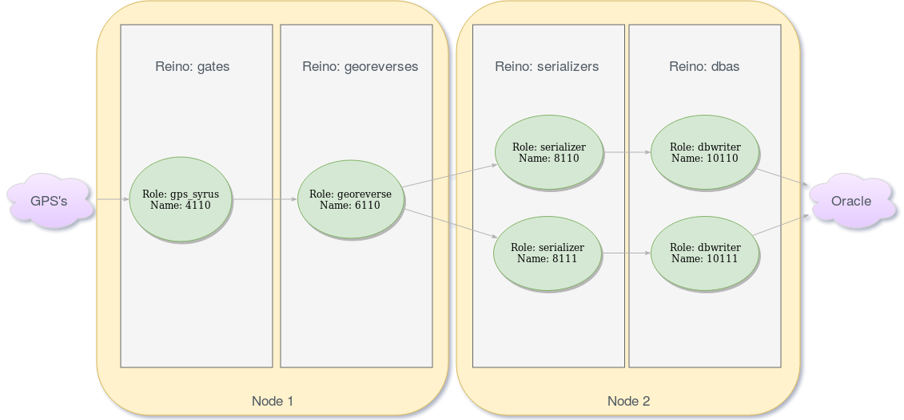

Yuneta
======

-------------------------------------------------

Dominio
=======

-------------------------------------------------

¿Qué es Yuneta?
===============

Una **herramienta** que integra desarrollo y producción (`DevOps <https://es.wikipedia.org/wiki/DevOps>`_)

Desarrollo:

    - Framework de desarrollo rápido de alto nivel.

Producción:

    - CLI y GUI para despliegue, monitorización y operación de aplicaciones.

-------------------------------------------------

Background
==========

Expertos en:

    - **Código abierto** (open source)
    - No inventamos la rueda: integramos las mejores librerías de código abierto.

Sistemas Operativos:

    - Linux

Lenguajes:

    - Back-end: C
    - Front-end: Javascript
    - Utilidades: Python

-------------------------------------------------

Filosofía
=========

    - **Normalizamos** el trabajo de desarrollo y operación
    - Para hablar el mismo lenguaje que **negocio**.

Describe tu sistema o negocio mediante:

    - Actores con **role** y/o **nombre** (*yunos*).
    - Interconecta los yunos mediante **servicios**
      (`SaaS <https://es.wikipedia.org/wiki/Software_como_servicio>`_,
      `Microservices <https://en.wikipedia.org/wiki/Microservices>`_,
      `FaaS <https://en.wikipedia.org/wiki/Function_as_a_service>`_)
      y **mensajes** (`MOP <https://www.joeforshaw.com/blog/message-oriented-programming>`_).

Distribución, potencia y fiabilidad:

    - Construye redes, distribuye los yunos en multiples **nodos** organizados en **reinos**.

-------------------------------------------------

Filosofía
=========

Ley de Correspondencia o Ley de Analogía.

    - Como es arriba es abajo. Como es abajo es arriba.

Teoría de grafos.

    - Grafo: conjunto de Vertices/Aristas

    - Todo lo que se pueda describir con `grafos <https://es.wikipedia.org/wiki/Teor%C3%ADa_de_grafos>`_
      se puede implementar con Yuneta.

.. image:: ./static/grafo.png
   :scale: 100 %

-------------------------------------------------

Filosofía
=========

Arbol jerárquico de objetos dentro de un yuno.

Los objetos se comunican mediante mensajes
(evento + kw `json <https://es.wikipedia.org/wiki/JSON>`_).

-------------------------------------------------

Filosofía
=========

Reinos y yunos en un negocio de trazabilidad.

Dentro del sistema los yunos se comunican mediante mensajes `json <https://es.wikipedia.org/wiki/JSON>`_.

Los mensajes entrantes al sistema se normalizan con un esquema json adaptado a cada negocio.

Los mensaje salientes del sistema se adaptan al periférico destino.

-------------------------------------------------

CLI / GUI
=========

CLI

    - Mendiante el CLI (consola linux) podemos desplegar yunos, arrancarlos, pararlos, crear nodos nuevos, clonarlos, monitorizarlos, etc.

GUI

    - Mediante el GUI (aplicación Web) podemos monitorizar y realizar tareas básicas de operación. O complejas, depende de lo que quiera el cliente. El GUI se hace a medida del cliente.

-------------------------------------------------

Ambitos de aplicación
=====================

Yuneta es fundamentalmente una herramienta de **comunicaciones**, ideal para:

    - un mundo **distribuido**, **interconectado**, por ejemplo:

        - `IoT <https://en.wikipedia.org/wiki/Internet_of_things>`_
        - `Blockchain <https://es.wikipedia.org/wiki/Cadena_de_bloques>`_

Puede integrar cualquier tecnología gracias al uso de los lenguajes C y python_ y el mundo open source:

    - Protocolos (http, websocket, ...)
    - Bases de datos SQL (sqlite_, oracle_, postgres_, ...) y Non-SQL (redis_, kafka_)
    - `Deep Learning <https://en.wikipedia.org/wiki/Comparison_of_deep_learning_software>`_

.. _python: https://www.python.org/
.. _sqlite: https://www.sqlite.org/index.html
.. _oracle: https://vrogier.github.io/ocilib/
.. _postgres: https://www.postgresql.org/
.. _redis: https://redis.io/
.. _kafka: https://kafka.apache.org/

-------------------------------------------------

Librerías en las que se basa Yuneta
===================================

Yuneta está construido principalmente sobre las siguientes librerías de código abierto:

* libuv_
* jansson_.

Además de otras como:

* `http parser`_
* pcre2_
* unwind_
* curl_
* rrdtool_
* sqlite_

.. _ASN.1: https://es.wikipedia.org/wiki/ASN.1
.. _json: http://www.json.org/
.. _http parser: http://github.com/joyent/http-parser
.. _pcre2: http://www.pcre.org
.. _unwind: http://www.nongnu.org/libunwind
.. _libuv: http://libuv.org
.. _jansson: http://www.digip.org/jansson
.. _curl: https://curl.haxx.se/
.. _sqlite: https://sqlite.org/
.. _rrdtool: http://oss.oetiker.ch/rrdtool/

-------------------------------------------------

Depliegue y Operación
=====================

Con la propia herramienta se han construido una serie de yunos standalone
para facilitar el despliegue y operación de yunos.

- **yuneta_agent**: Agente de reinos, se instala uno en cada nodo de Yuneta.
- **yuneta**: CLI (Command Line Interface), consola para operar el nodo local o nodos remotos.
- **ybatch**: Ejecuta comandos del agente en nodo local o remoto.
- **ylist**: Lista los yunos corriendo en un nodo.
- **yshutdown**: Apaga todos los yunos de un nodo, incluido el agente.
- **ystats**: Obtiene estadísticas de un yuno local o remoto.
- **ytestconfig**: Verifica un fichero de configuración json.

-------------------------------------------------

Reíno de utilidades
===================

Yuneta suministra también un reino de utilidades, con yunos ciudadanos, útiles para controlar y monitorizar cada nodo:

- **emailsender**: yuno para envio de emails.
- **logcenter**: yuno centralizador de todos los logs del nodo.
- **statscenter**: yuno capturador de datos de otros yunos del nodo, generador de estadísticas y gráficas.

